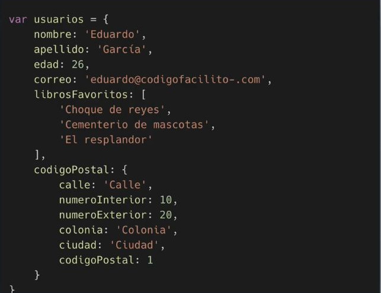

# Introducción al Tutorial

>En este tutorial aprenderremos a manejar y dominar el gestor de base de datos MongoDB. Uno de los gestores noSQL más populares en la actualidad.

Este tutorial es de un nivel básico e intermedio. Así que si no tienes conocimientos prévios de MongoDB, no te preocupes, ya que comenzaremos desde cero. Desde la instalación, pasando por los comandos básicos, en donde aprenderemos a crear, leer, actualizar y eliminar documentos.

>Una vez hayamos dominado los conceptos, las bases, aumentaremos un poco el grado de complejidad y comenzaremos a trabajar con documentos anidados, listas, relaciones, pipelanes, funciones, triggers y mucho más.

Enla recta final del curso, para reforzar todo lo aprendido, trabajaremos con un pequeño proyecto en Node, el cual, utilizando la librería de node-mongodb y el servicio en linea de atlas, seremos capaces de programar un catálogo de ventas. Algo bastante interesante.

:::tip Pre-requisitos
Para que puedas tomar este tutorial, será necesario que cuentes con ligeras nociones de JavaSript. Ya que te adelanto, es posible ejecutar código JavaSript junto con MongoDB. Además, es deseable que previamente hayas trabajado con algún otro sistema de Base de Datos. Por ejemplo: MySQL, PostgreSQL, SQLServer, etc. Esto, para que ciertos conceptos no te resulten difíciles de comprender.
:::

Comencemos...

## ¿Qué es mongoDB?
https://codigofacilito.com/videos/que-es-mongodb

Es importante definir qué es exactamente mongoDB, por lo que explicaremos en detalle, qué es una base de datos no relacional (noSQL), qué es mongoDB, qué es una colección y qué es un documento.

## Base de Datos Relacional (SQL)

Una base de datos relacional se trata de un conjunto de tablas, las cuales almacenan información de forma estructurada. Una tabla posee columnas y filas. Muy similares a las hojas de cálculos. en una base de datos relacional, las tablas poseen relación entre si. Esto mediante datos redundantes los cuales conocemos como llaves foraneas. Muy probablemente ya hemos trabajado con bases de datos relacionales anteriormente, como lo puede ser PostgreSQL o MySQL, por mencionar algunos.

Algo que debemos de tener muy en cuenta, es que la gran mayoría de las bases de datos relacionales utilizan el lenguaje SQL para realizar consultas.

## Qué es Base de Datos Relacional (noSQL)

Las base de datos no relacional son también conocidas como base de datos noSQL. Una base de datos no relacional es muy diferente, ya que la información no se almacena en tablas. Principalmente debido a que este tipo de base de datos están diseñadas para modelos no convencionales. En donde es necesario tener un esquema flexible (no tan "cuadrado", por así llamarlo) como una relacional no se ofrece.

Por ejemplo, imaginemos que tenemos la necesidad de desarrollar una aplicación en la cual es necesario almacenar mucha información del usuario. sin embargo, dicha información puede ser opcional, puede encontrarce o no. Quizá un usuario accede a darnos su dirección posta. Pero se recerva el derecho a proporcionarnos su provincia, su calle, su numero de casa, etc.

En estos casos, es cierto, podemos usar una base de datos relacional como de costumbre. Sin embargo, es muy probable que tengamos problemas al momento de recuperar información. Ya sea por la gran cantidad de campos nulos, datos redundantes o inclusive, datos sin formatos y fuera de estandar. Para evitar esto, sin duda, una base de datos no relacional.

También es importante mencionar, que así como existen opciones para las bases de datos relacionales también las hay para las no relacionales. Por ejemplo, tenomos Redis, Cassandra o en este caso, mongoDB. El sistema en el cual estaremos trabajando a lo largo de este tutorial.

## Qué es mongoDB

MongoDB es una base de datos no relacional. Este sistema se encuentra enfocado en el manejo de documentos. En primera instancia, podemos pensar que un documento, en mongoDB, puede ser un archivo pdf, txt, html, etc. Pero esto no es así.

## Qué es un documento

Un documento en mongoDB, podemos verlo como un objeto JSON de Javascript. Un documento puede poseer la n cantidad de atributos que deseemos. En el, podemos almacenar cadenas, enteros, flotantes, booleanos, fechas, listas e inclusive, otros documentos.

Aquí, un pequeño ejemplo:

Por si te lo preguntabas, el tamaño máximo de un documento será de 16 mega bite, lo cual es, muchísimo espacio.

Con el concepto de documentos, también biene el concepto de colecciones.

## Que es una colección

Una colección, no es más que el conjunto de documentos, bastante sencillo.

Si un documento es, en mongoDB, en analogía una fila en una base de datos relacional. Entonces, una colección, podemos verla, como la analogía a una tabla.

## Conclusión

Estos serían los conceptos básicos para comenzar con mongoDB.

